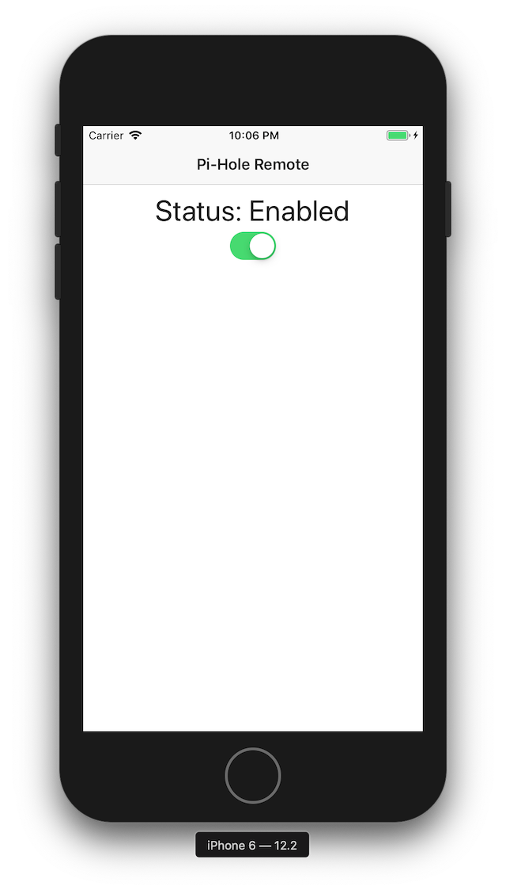

# Pi Hole Remote
Just a simple mobile app I decide to make for enabling and disabling adblocking on my [Pi Hole](https://pi-hole.net/). For those times when I need to use a website that is getting blocked because my Pi Hole thinks it's an ad. The app is written in [Svelte Native](https://svelte-native.technology/). A framework that combines [Svelte](https://svelte.dev/) and [Nativescript](https://www.nativescript.org/). Originally created using the [Svelte Native Template](https://github.com/halfnelson/svelte-native-template).



### Getting Started

Follow the [quick start guide](https://svelte-native.technology/docs#quick-start) to set up [Svelte Native](https://svelte-native.technology/).

```
$ npm install
$ npm start
```